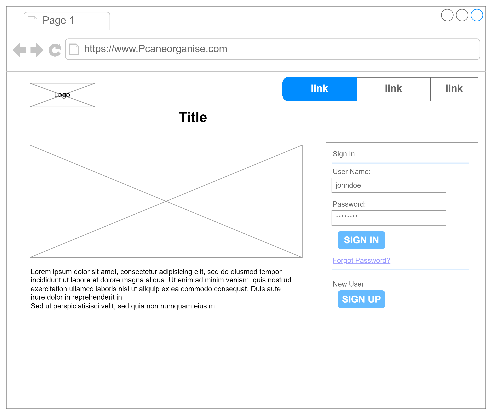

Capstone Project 
Project Overview 
Pcane Organise is a web-based app that will be used by PressCane employees to manage and organize their tasks on a daily basic.
The purpose is to get the most out of employees during work hours, most hours are lost without being accounted for, less productivity, reports without backup evidence.
The system will help employees keep track of the daily activities, manage time properly, goal setting and prioritizing the most important tasks at hand.
This will ease the stress on the users and they’ll have time to work and get proper rest. They will also produce valid reports at the end of the day.

Features and Functionalities 
The system will have the following features and functionalities
Task Creation and Management:
•	Ability to create, edit, and delete tasks.
•	Option to set task titles, descriptions, due dates, priorities, categories, and tags.
Task Categorization:
•	Allow users to categorize tasks into different categories or projects for better organization.
Due Dates:
•	Enable users to set due dates for tasks to prioritize and manage deadlines effectively
Priority Levels:
•	Provide options for users to assign priority levels (e.g., high, medium, low) to tasks to indicate their importance.
Search and Filtering:
•	Implement search functionality to allow users to search for specific tasks by keywords or titles.
•	Provide filtering options based on due dates, priority levels, categories, or custom criteria.
Reminders or Notifications:
•	Allow users to set reminders or notifications for important tasks to ensure they don't miss deadlines.

Technologies Used:
The system will use HTML, CSS, Python JavaScript, MySQL, Flask, API and Git

Screenshots or Demo:
below is the screenshot for the low fidelity prototype drawn using draw.io

Roadmap and future enhancements
The flowchart showing the front page of the app will flow.
[alt text](<Flowchart (1).png>)

In the future the system will include feat!ures like sending alerts in emails and SMS’s.
Mobile app support 
Integration with third party tools

Contact information
Email: aphiri@pressthanolmw.com
Phone: +265 888 996 691
Linkedin: https://www.linkedin.com/in/arnold-phiri-4920637b/  

